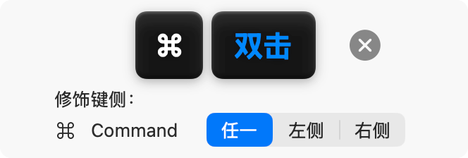

<div align="center">
  
  <h1>HotKeyManager</h1>
  <p>
    专为 macOS打造的强大、现代且易用的全局快捷键管理库
  </p>

  <p>
    <strong>🇨🇳中文</strong>  | <strong><a href="./README.md">🇬🇧English</a></strong>
  </p>

  <p>
    =15-lightgrey?style=flat-square&logo=apple" alt="Platform: macOS>=15">
    
    
    
  </p>
</div>

---

**HotKeyManager** 是一个专为 macOS打造的强大、现代且易用的全局快捷键管理库。它基于 SwiftUI 和 Swift Concurrency 构建，为您提供了录制、存储和监听全局快捷键的一站式解决方案。

## 特性

- 🚀 **现代 API**: 基于 Swift Concurrency (`async`/`await`) 和 SwiftUI 构建。
- 🎯 **双击支持**: 支持检测修饰键双击（例如：双击 `Cmd`）。
- 🎨 **精美 UI**: 内置精致、可定制的 `HotKeyRecorder` 录制视图。
- 💾 **自动持久化**: 使用 `UserDefaults` 自动保存和加载快捷键设置。
- 🛡️ **安全稳健**: 完美处理笔记本上的隐式 `Fn` 键等边缘情况，防止冲突。
- 🌍 **多语言支持**: 支持中文、英语、日语、西班牙语、法语和德语等。

### 安装

将 `HotKeyManager` 添加到您的 `Package.swift`：

```swift
dependencies: [
    .package(url: "https://github.com/L1cardo/HotKeyManager", branch: "main")
]
```

## 使用方法

### 1. 定义快捷键

使用 `HotKeyManager.Name` 定义您的快捷键。支持直接使用字符串字面量。

```swift
import HotKeyManager

extension HotKeyManager.Name {
    // 有默认值
    static let startRecording = Self("startRecording", default: HotKey(key: nil, modifiers: [.command], isDoubleTap: true))
    // 无默认值
    static let stopRecording = Self("stopRecording")
}
```

### 2. 录制快捷键

将 `HotKeyRecorder` 视图添加到您的设置界面中。

```swift
import HotKeyManager
import SwiftUI

struct SettingsView: View {
    var body: some View {
        Form {
            Section("通用") {
                HotKeyManager.Recorder(for: .startRecording)
                HotKeyManager.Recorder(for: .stopRecording)
            }
        }
    }
}
```

### 3. 监听事件

注册快捷键的处理程序。您可以监听 `.keyDown`（按下）、`.keyUp`（抬起）。

```swift
@main
struct MyApp: App {
    @NSApplicationDelegateAdaptor(AppDelegate.self) var appDelegate

    var body: some Scene {
        ...
    }
}

class AppDelegate: NSResponder, NSApplicationDelegate {
    func applicationDidFinishLaunching(_: Notification) {
        HotKeyManager.on(.keyDown, for: .startRecording) {
            print("Key Down Triggered!")
        }

        HotKeyManager.on(.keyUp, for: .stopRecording) {
            print("Key Up Triggered!")
        }
    }
}
```

## 进阶功能

### 区分左右修饰键
您可以允许用户区分左右修饰键（例如：`左 Cmd` vs `右 Cmd`）。

```swift
HotKeyManager.Recorder(for: .toggleApp, modifirsSide: true)
```

## 📄 许可证

此项目采用 MIT 许可证 - 详见 [LICENSE](LICENSE) 文件。

## 🙏 致谢

- [KeyboardShortcuts](https://github.com/sindresorhus/KeyboardShortcuts)
- [Sauce](https://github.com/Clipy/Sauce)
- [Hex](https://github.com/kitlangton/Hex)

## 📞 支持

- **邮件**：[albert.abdilim@foxmail.com](mailto:albert.abdilim@foxmail.com)
- **GitHub Issues**：[在此报告问题](https://github.com/L1cardo/HotKeyManager/issues)
